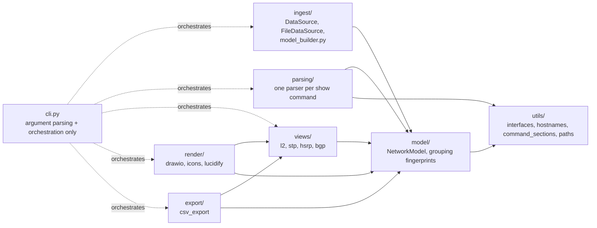
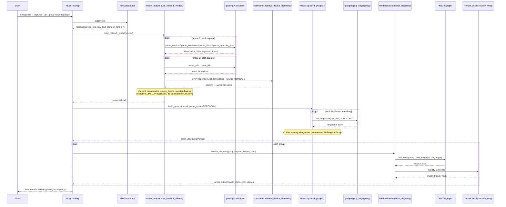
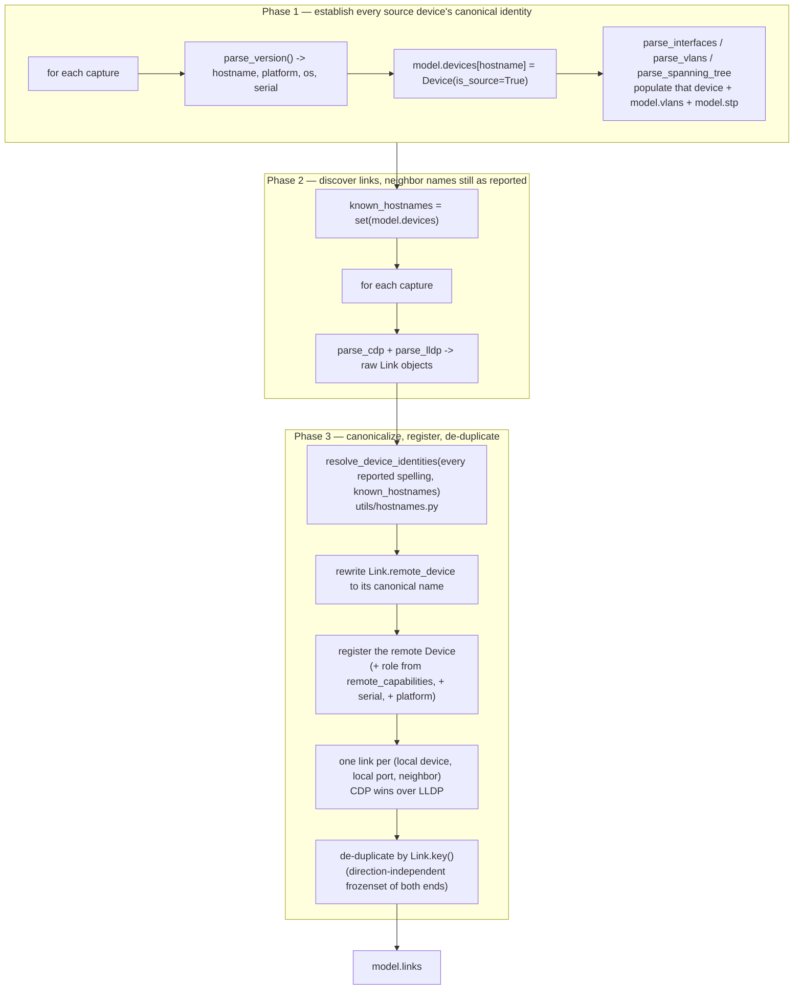
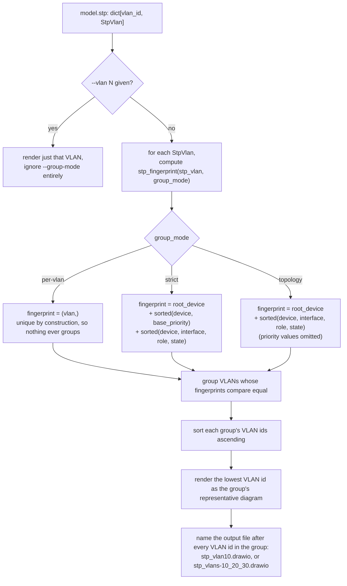
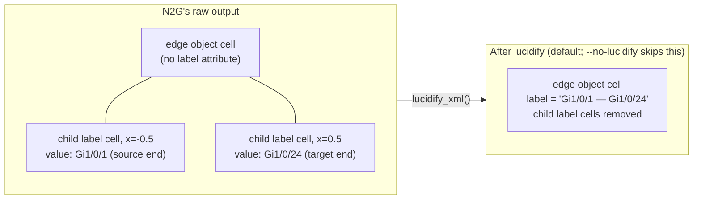

# Architecture

This document describes `nettopo`'s components, call flow, and the design decisions
behind them, in enough technical depth to work on the codebase without re-deriving it
from the source. It is kept in sync with the code — see the documentation-maintenance
rule in [`CLAUDE.md`](../CLAUDE.md). For scope, the full data model, and the CLI
reference, see [`PROJECT_SPEC.md`](../PROJECT_SPEC.md); for user-facing command/option
docs, see the [README](../README.md#usage).

## Current state (Phase 4)

| Command | Status | Reads | Writes |
|---|---|---|---|
| `nettopo parse` | real | every capture | `output/csv/*.csv` |
| `nettopo l2` | real | CDP/LLDP, interfaces | `output/l2/*.drawio` |
| `nettopo stp` | real | `show spanning-tree` | `output/stp/*.drawio`, `stp.csv` rows |
| `nettopo hsrp` | argument parsing only | — | exits 1, "not implemented yet" |
| `nettopo bgp` | argument parsing only | — | exits 1, "not implemented yet" |
| `nettopo all` | argument parsing only | — | exits 1, "not implemented yet" |

`hsrp`/`bgp`/`all` land in Phases 5–7 (`PROJECT_SPEC.md` §14). The rest of this document
describes both what exists today and the target architecture those phases build into.

## System overview

Every subcommand follows the same pipeline: **ingest → parse → model → view → render or
export**. `cli.py` is the only module that knows about all five stages; each stage only
knows about the one inward of it (see [Layering rule](#layering-rule-dependency-inversion)).



| Package | Responsibility |
|---|---|
| `ingest/` | Data sources. `base.py` defines the `DataSource` interface; `files.py` implements it over a directory of saved captures; `model_builder.py` wires parser output into a populated `NetworkModel`. |
| `parsing/` | One parser per `show` command. Returns plain dataclasses/lists — never touches `NetworkModel` directly. |
| `model/` | `entities.py`: the normalized dataclasses and enums (`NetworkModel` and everything it contains). `grouping.py`: the STP/HSRP fingerprint functions that decide which VLANs render identically. |
| `views/` | One module per diagram (`l2`, `stp`; `hsrp`/`bgp` pending). Reads the model, returns a render-ready `views/diagram.py` `Diagram`. Never parses text or writes files. |
| `render/` | `drawio.py` (the only module importing N2G), `icons.py` (`DeviceRole` → Cisco stencil), `lucidify.py` (Lucidchart-import post-process). |
| `export/` | `csv_export.py`: one CSV table per model entity. |
| `utils/` | Dependency-free shared services: `interfaces.py` (interface-name normalizer), `hostnames.py` (device-name normalizer), `command_sections.py` (multi-command capture splitter), `paths.py` (filename sanitization / output-root resolution). |
| `cli.py` | `argparse` setup and per-command orchestration only — no parsing or rendering logic lives here. |

### Layering rule (Dependency Inversion)

Dependencies point inward only:

```
parsing  -> model
views    -> model
render   -> views, model
export   -> views, model
cli      -> orchestrates all of the above
model    -> utils only
```

`model` never imports `render`, `views`, or N2G. This means the data model — the part
most worth protecting from churn — has no knowledge of how it is displayed or exported,
so a rendering-library change (see [Why N2G is isolated to one
module](#why-n2g-is-isolated-to-one-module)) or a new export format cannot ripple back
into parsing or modeling code.

## End-to-end call flow

`nettopo stp -i captures --all --group-mode topology` exercises every stage of the
pipeline (ingestion, three-phase model building, grouping, rendering), so it is used here
as the representative example. `nettopo l2` and `nettopo parse` follow the same shape
minus the grouping step.



## Ingestion and model building

### Why an ingestion interface

`ingest/base.py` defines a `DataSource` interface; `ingest/files.py` implements it by
reading a directory of saved captures. v1 ships file-based ingestion only (see
`PROJECT_SPEC.md` section 2, "out of scope"), but the interface exists now so that a
future live-collection source (netmiko/scrapli over SSH) can be added by implementing
the same interface, without touching `parsing/`, `model/`, or `views/`.

### Three-phase model building

`ingest/model_builder.py`'s `build_network_model()` cannot resolve neighbor identities
while it discovers them. Deciding what to call a neighbor needs two things that are only
complete once *every* capture has been read: the set of source-device hostnames, and the
set of all spellings that neighbor was reported under. So the build registers source
devices first, then collects raw links, then resolves identities and writes the links
into the model.



**Why neighbor names are resolved instead of used as-is.** CDP and LLDP disagree about
what a device is called: the same Nexus is `nxos-core1` in one protocol's output and
`nxos-core1(FDO21120U5D)` in the other's, and a device's FQDN
(`sw2-dist.example.com`) routinely appears where its own capture says `sw2-dist`. Each
uncorrelated spelling becomes its own non-source `Device`, so one switch is drawn as
several nodes with parallel links. `utils/hostnames.py` owns the correlation rules
(`PROJECT_SPEC.md` §5.2); a neighbor whose spelling correlates with nothing else (e.g.
`core-rtr.example.com`, seen only in CDP output) is kept as a non-source `Device` under
the name it was reported by — it may still get a role (see below) even though it's never
a source device.

**Why one link is kept per local port and neighbor.** Both protocols describe the same
adjacency, and they do not always describe it identically: `Link.key()` alone cannot
collapse them when LLDP names the neighbor's port differently from CDP. Keeping one link
per `(local device, local port, neighbor)` — CDP first, since it names Cisco ports more
reliably — removes that second edge without touching genuinely distinct adjacencies: a
phone and a PC on one access port are different neighbors, and two links to the same
neighbor leave from different local ports.

**Why `Device.role` is inferred from neighbor capabilities, not self-reported.**
`render/icons.py` maps `DeviceRole` to a Cisco icon, but a device's own CDP/LLDP output
never reports its own capabilities — so role is inferred from how *other* devices'
CDP/LLDP describe it (`Capabilities: Router` / `Switch` / `Phone` / `Host`). This
inference is applied to every raw link as it is registered (step J above), before the
two directions of a source-to-source link are deduplicated into one `Link` (step L):
deduplication keeps only one direction's `remote_capabilities`, so inferring role only
from the deduplicated list would silently leave whichever device ended up on the
discarded side at `DeviceRole.UNKNOWN`. A device never described by any neighbor's
capabilities (e.g. an isolated source device) stays `UNKNOWN` and renders as a plain box
rather than a guessed icon.

**Why `Device.platform` is backfilled from CDP/LLDP, and only for non-source devices.**
`Device.platform` normally comes from the device's own `show version`, which a device we
hold no capture for does not have — yet every neighbor that sees it reports one
(CDP's `Platform:` line, LLDP's inventory `Model:`), already carried on the `Link` as
`remote_platform`. Registering a remote device therefore also copies that value, so
`devices.csv` names the hardware of neighbors as well as of source devices. Two rules
govern which value wins: a source device keeps whatever its own `show version` produced,
*including* nothing, since a neighbor's view of it is never more authoritative than its
own; and among neighbor reports CDP outranks LLDP, because CDP always prints the chassis
model where LLDP's is an optional TLV many implementations leave empty. The ranking is
resolved up front, over all raw links (`_platforms()`), rather than first-come inside the
registration loop — otherwise the answer would depend on the order the captures happened
to be read in. `Device.model` (the vendor-prefix-stripped form) is deliberately *not*
derived this way: CDP platform strings are free text and are not always a hardware model
at all (`VMware ESXi`), so inferring one would put noise in a column that today only ever
holds a parsed `show version` value.

### Why interface-name normalization is centralized

The same physical port can appear as `Gi1/0/1` in one `show` command's output and
`GigabitEthernet1/0/1` in another. If parsers normalized independently, or not at all,
correlation across commands (and across devices) would silently fail. `utils/interfaces.py`
is the single source of truth for this normalization; every parser routes interface
names through it before the name is stored anywhere in the model. See `PROJECT_SPEC.md`
§5.1 for the canonical abbreviation table.

### Why device-name normalization is centralized

Device names have the same problem one level up, with worse consequences: a mismatched
interface name splits one port, a mismatched device name splits an entire node and every
link attached to it. `utils/hostnames.py` is the single source of truth here, and unlike
interface names it is applied in `ingest/model_builder.py` rather than in the parsers —
correlating spellings requires seeing all of them at once, which no individual parser
does. Parsers therefore report neighbor names exactly as the device printed them.
`PROJECT_SPEC.md` §5.2 has the resolution rules; the important property is that a
canonical name is always one of the observed spellings, never a constructed one.

## Parsing layer

Every parser takes raw multi-command capture text plus (usually) the local device's
hostname, and returns plain dataclasses — it never writes into `NetworkModel` itself;
`ingest/model_builder.py` owns that. `utils/command_sections.py`'s
`extract_command_output()` is the shared first step: it finds the prompt line whose
command matches a pattern and returns just that command's output slice.

| `show` command | Parser | Technique | Populates |
|---|---|---|---|
| `show version` | `parsing/version.py` | ntc-templates | hostname, `Device.platform/model/os/serial` |
| `show ip interface brief`, `show interfaces` | `parsing/interfaces.py` | ntc-templates | `Device.interfaces` |
| `show vlan brief` | `parsing/vlan.py` | ntc-templates | `NetworkModel.vlans` |
| `show cdp neighbors detail` | `parsing/cdp.py` | ntc-templates | raw `Link`s (`discovery="cdp"`) |
| `show lldp neighbors detail` | `parsing/lldp.py` | ntc-templates | raw `Link`s (`discovery="lldp"`, see below) |
| `show etherchannel summary`, `show port-channel summary` | `parsing/etherchannel.py` | ntc-templates (see below) | `Interface.po_id`, `Interface.po_members` |
| `show spanning-tree` | `parsing/spanning_tree.py` | **own regexes** (see below) | `NetworkModel.stp` (`StpBridge`, `StpPort`) |
| `show standby brief` | `parsing/hsrp.py` | not yet implemented | — (Phase 5) |
| `show ip bgp summary` | `parsing/bgp.py` | not yet implemented | — (Phase 6) |

All ntc-templates-backed parsers go through `parsing/_textfsm.py`, a thin typed wrapper
around `ntc_templates.parse_output` — the one place the untyped `ntc_templates` import
boundary exists.

### Why the port-channel parser picks its template from the prompt line

Every other parser derives its ntc-templates command name from a fixed string, because
one command has one name. The bundle table does not: IOS and IOS-XE print it under
`show etherchannel summary`, NX-OS under `show port-channel summary`, and ntc-templates
ships one template per spelling — never both for the same platform. `parsing/
etherchannel.py` therefore matches both prompt-line spellings and uses whichever one the
capture actually contains to select the template. A capture whose spelling has no
template for the platform in effect (an NX-OS capture parsed under the `cisco_ios`
default, say) logs a warning and yields no bundles, rather than aborting the run over a
`--platform` mismatch.

### Which LLDP field names the neighbor's port

LLDP offers two candidates for the remote interface and neither is reliable on its own.
IOS puts the port's name in "Port Description" and often a MAC address in "Port id";
NX-OS puts the port's *configured description* ("uplink-to-acc-sw3") in "Port
Description", which correlates with nothing — CDP and LLDP then describe the same
physical link differently and it survives de-duplication as a second, bogus edge.
`parsing/lldp.py` picks whichever field `utils/interfaces.py`'s `looks_like_interface()`
recognizes (an interface type immediately followed by a number), preferring the
description when both qualify, and falls back to the description when neither does — a
non-Cisco port name like `vmnic0` is still better than nothing.

### Why `spanning_tree.py` doesn't use ntc-templates

`show spanning-tree`'s shipped template (`cisco_ios_show_spanning-tree`) only captures
the per-interface role/state/cost table — it has no fields for the "Root ID"/"Bridge ID"
blocks that carry the data `StpBridge` needs (priority, MAC, root-election flag). Rather
than mixing a TextFSM pass for the port table with hand-written regex for the bridge
blocks, `parsing/spanning_tree.py` parses the whole command output itself: both blocks
are simple, line-anchored, stable text, so one self-contained regex-based parser is
simpler than two parsing strategies for one command. IOS and IOS-XE emit this command
identically (unlike `show version`, which does differ enough to need the OS-detection
logic in `parsing/version.py`), so the same parser serves both —
`tests/fixtures/spanning_tree/` carries one fixture per OS to prove it.

Concretely, per VLAN block it extracts two things independently:

1. **Root ID / Bridge ID** — `Root ID` gives this device's view of the root bridge (and
   whether *this* device is the root, via the "This bridge is the root" line); `Bridge
   ID` gives this device's own priority, sys-id-extension, and MAC. Together these
   become one `StpBridge`.
2. **The port table** — the `Interface / Role / Sts / Cost / Prio.Nbr / Type` rows,
   parsed into `StpPort`s after mapping Cisco's abbreviations (`Root`/`Desg`/`Altn`/
   `Back`/`Disb`, `FWD`/`BLK`/`LRN`/`LIS`/`DIS`) onto `StpRole`/`StpState`.

`ingest/model_builder.py` then folds each device's per-VLAN `StpBridge` + `StpPort`s
into the shared `model.stp[vlan_id]: StpVlan`, and records whichever device reported
itself as root as that VLAN's `root_device`.

## The data model and grouping

`model/entities.py` holds the full normalized data model (`NetworkModel` and every
dataclass/enum it's built from) — see `PROJECT_SPEC.md` section 6 for the exact shapes;
it is not duplicated here to avoid the two documents drifting out of sync.

### Why grouping is a separate concern from views

STP and HSRP views can be generated per-VLAN, or with VLANs grouped by resulting
topology fingerprint (`strict` groups on exact configured priority + topology; `topology`
groups on topology alone, ignoring priority). The fingerprint functions live in
`model/grouping.py`, not in the view modules, because the notion of "these VLANs produce
the same diagram" is a property of the model, independent of how that diagram is later
rendered.

### STP grouping flow



`strict` and `topology` differ only in whether priority values participate in the
fingerprint — equal priority does not guarantee equal topology (differing port costs or
states can move the blocked link), which is why grouping is defined by the *resulting*
fingerprint and never by raw configured priority alone. See
`tests/test_grouping.py` for the two boundary cases this must get right (same priority
but different topology; same topology but different priority), reconfirmed against real
parsed captures in `tests/test_views_stp.py` and `tests/fixtures/stp_topology/`.

## Views

| View | Module | Reads | Options | Produces |
|---|---|---|---|---|
| L2 | `views/l2.py` | `model.devices`, `model.links` | `--endpoints all\|network-only`, `--link-mode physical\|port-channel` | one `Diagram` |
| STP | `views/stp.py` | `model.stp`, `model.links`, `model.devices` | `--vlan`, `--group-mode` | one `Diagram` per VLAN or per topology group |
| HSRP | `views/hsrp.py` | — | — | not yet implemented (Phase 5) |
| BGP | `views/bgp.py` | — | — | not yet implemented (Phase 6) |

### Why the STP view cross-references `model.links`

A `StpPort` records a device's own port role/state for a VLAN, but not which device is
on the other end of that port — spanning-tree data alone cannot say "this link goes to
sw2". `views/stp.py` gets that from `model.links` (built from CDP/LLDP, the only place
that records device-to-device physical adjacency) and looks up each link's two ends in
the VLAN's `StpPort` map to label and color it. A link where neither end has STP data
for that VLAN (e.g. a link outside the VLAN's spanning tree) is excluded. Root-bridge
highlighting and port-state link coloring are carried on the `Diagram` itself
(`DiagramNode.highlight`, `DiagramLink.color`) so `render/` can apply them as generic
style overrides without knowing anything about STP.

### Why grouped STP diagrams render one representative VLAN

`model/grouping.py`'s fingerprints guarantee that VLANs grouped under `strict` or
`topology` produce an identical rendered diagram — that is what "grouped" means (see
[STP grouping flow](#stp-grouping-flow) above). `views/stp.py` exploits that guarantee:
instead of re-deriving a merged diagram, it renders the lowest-numbered VLAN in each
group and labels the output file with every VLAN id the group covers
(`stp_vlans-10_20_30.drawio`).

### Why MLAG grouping is a mode rather than the default

`views/l2.py`'s `LinkMode` decides what one drawn link means: `PHYSICAL` draws one link
per discovered adjacency, `PORT_CHANNEL` collapses every adjacency belonging to the same
bundle into one. Both are needed and neither subsumes the other — the physical view is
what you want when tracing a cable or a single port's state, the bundle view is what you
want when reading the logical topology of a network where every uplink is an
EtherChannel. `PHYSICAL` stays the default because it is the lossless one: it never hides
a member port. Where no bundles exist, the two modes produce identical output, so the
option costs nothing on networks without port-channels.

The member interfaces a bundle hides are not lost — they travel in `DiagramLink.tooltip`
and are rendered as the draw.io `tooltip` attribute on the link's `<object>` cell, which
draw.io shows on hover in place of its default attribute dump.

**Bundling is keyed on the device pair, not on link direction.** A bundle end is
identified by its port-channel name — `Interface.po_id` for a member port,
`Interface.po_members` for the port-channel interface itself, since CDP/LLDP on NX-OS may
report an adjacency on `Po1` rather than on a member port. Only source devices have
interfaces populated, so an adjacency toward a device we hold no capture for is bundled
by its near end alone; that far end is then labeled with the member ports the neighbor
reported instead of a `Po` name. The key sorts its two ends by device name rather than
using the link's own local/remote direction, because `ingest/model_builder.py` keeps one
direction per physical link and *which* direction depends on whose capture reported it
first — two members of one bundle reported from opposite ends would otherwise become two
separate bundles.

## Rendering and export

### Why N2G is isolated to one module

`render/drawio.py` is the only module that imports N2G. If N2G is ever replaced, only
that module changes — `views/` and `model/` are unaffected because they depend on
neither N2G nor draw.io concepts. `render/icons.py` maps `DeviceRole` (and, since Phase
4, a `highlight` flag) to a draw.io style string; `render/drawio.py` turns each
`DiagramNode`/`DiagramLink` into an `add_node`/`add_link` call, applies N2G's
igraph-backed `kk` layout, then hands the dumped XML to `lucidify.py` unless
`--no-lucidify` was passed.

### The lucidify post-process

N2G emits each link's per-end interface label (`src_label`/`trgt_label`) as a separate
child `mxCell` vertex with geometry *relative to the link's own edge cell*
(`x="-0.5"` near the source, `x="0.5"` near the target). Lucidchart's draw.io importer
does not handle that relative-geometry child-of-an-edge pattern and mangles or drops
these labels. `render/lucidify.py` collapses them into a single `label` attribute on the
edge's own `object` cell instead — an attribute Lucid imports correctly — and removes
the now-redundant child cells. It also cleans up the doubled semicolons N2G's XML
templates leave behind in style strings.



Applied to every generated diagram by default; `--no-lucidify` leaves N2G's raw output
in place (useful for debugging the pre-collapse structure).

### Known limitation to validate early: Cisco icons under Lucid import

`render/icons.py` maps device roles to `mxgraph.cisco.*` draw.io stencils, verified
against the actual shape names in jgraph/drawio's `Sidebar-Cisco.js` rather than
guessed. Lucidchart uses a different shape library, so these stencils may still degrade
to plain boxes on import even with the correct names. Cisco icons are a confirmed
requirement, so v1 keeps them and accepts this tradeoff; `render/lucidify.py`'s label
collapsing (above) at least keeps interface labels intact through that import.

**Status: implementation complete, live-import validation still pending.** Real
fidelity against an actual Lucidchart import has not yet been checked by a human with
Lucid access. Phase 4 (STP) proceeded on the same rendering approach without waiting for
this, since it requires interactive access this project's automation does not have;
whoever runs the checklist below should treat Phase 3's L2 output and Phase 4's STP
output (root-highlight and port-state link colors are new draw.io style overrides in
`render/icons.py`/`render/drawio.py`) as equally unvalidated. Checklist for whoever runs
this:

1. Generate samples:
   `nettopo l2 -i tests/fixtures/captures -o /tmp/lucid-check`
   `nettopo stp -i tests/fixtures/stp_topology -o /tmp/lucid-check --all --group-mode topology`
2. Import `/tmp/lucid-check/l2/l2_full.drawio` and one of
   `/tmp/lucid-check/stp/*.drawio` into a Lucidchart document.
3. Record, here in this section: whether the Cisco device shapes render recognizably or
   degrade to plain boxes; whether the collapsed link labels (e.g.
   `Gi1/0/1 — Gi1/0/24`) survived the import; and whether the STP root-highlight border
   and forwarding/blocking link colors survived.

## Security posture

`nettopo` makes zero network connections by design — it only reads local capture files
and writes local output files. `tests/test_no_network.py` enforces this by
monkeypatching `socket.socket` to fail and asserting a full run still succeeds; Phase 3
extends the base `parse`-only test to cover `nettopo l2` now that it pulls in
N2G/igraph, Phase 4 extends it again to cover `nettopo stp`, and it will extend further
to cover `nettopo all` once Phase 7 adds that command.

`utils/paths.py`'s `resolve_output_root()` is used by every command to resolve `-o`/
`--output` to an absolute path before anything is written. Its `sanitize_filename_component()`
and `safe_join()` guard against a filename derived from parsed data (e.g. a hostname
like `../../etc`) escaping the output directory; today's real output filenames don't
yet need them in practice — `l2`'s two filenames are a fixed lookup table and `stp`'s
are built from VLAN ids, which are ints parsed out of the model rather than arbitrary
path input, so they can't contain a path separator — but the helpers are unit-tested
(`tests/test_paths.py`) and ready for the day a filename is built from a raw string like
a hostname. `export/csv_export.py` separately neutralizes *cell* values that start with
a formula-triggering character (`=`, `+`, `-`, `@`) so a hostname or description can't
execute as a formula when the CSV is opened in spreadsheet software — a different attack
surface (CSV formula injection) from filename path traversal. See `PROJECT_SPEC.md`
section 11 for the full OWASP-adapted security review.
