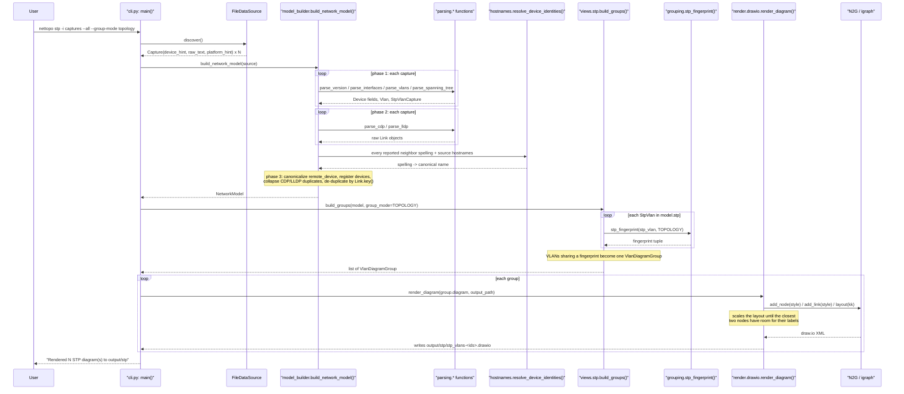
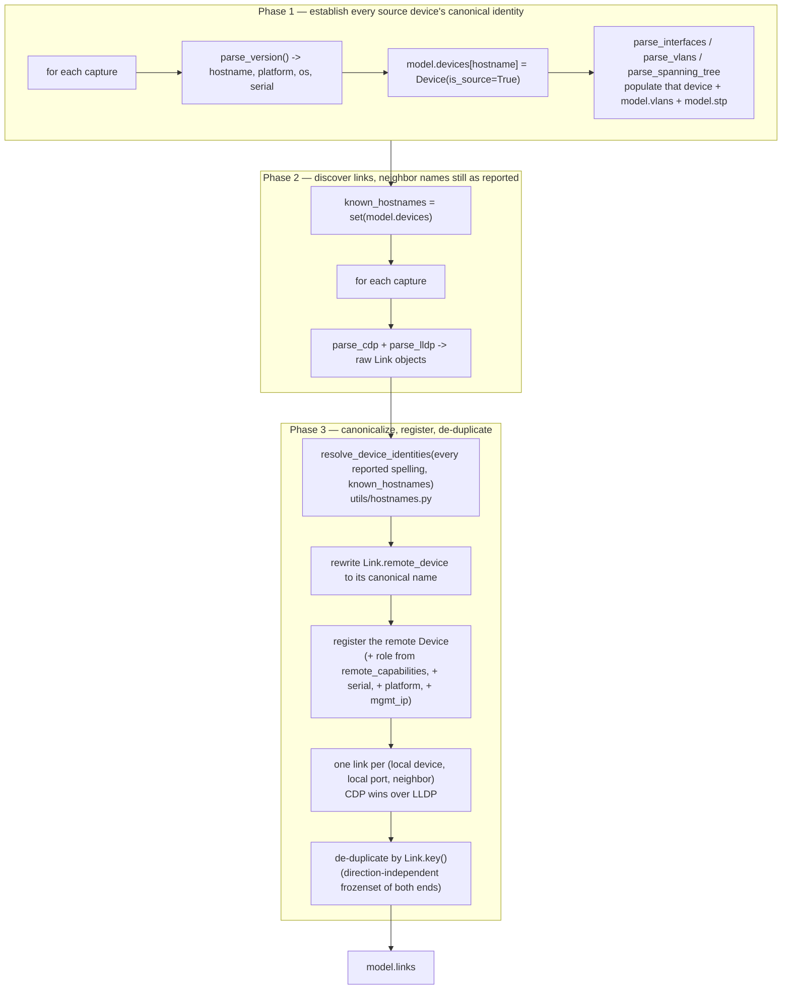
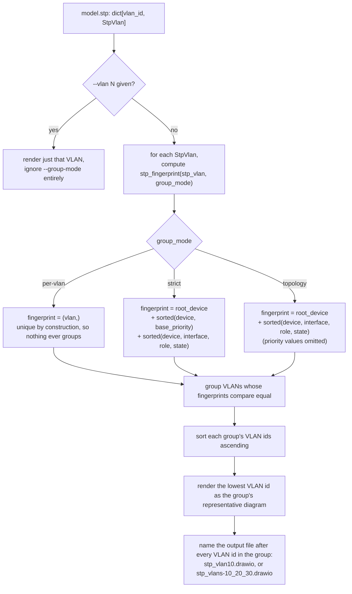

# Architecture

This document describes `nettopo`'s components, call flow, and the design decisions
behind them, in enough technical depth to work on the codebase without re-deriving it
from the source. It is kept in sync with the code — see the documentation-maintenance
rule in [`CLAUDE.md`](../CLAUDE.md). For scope, the full data model, and the CLI
reference, see [`PROJECT_SPEC.md`](../PROJECT_SPEC.md); for user-facing command/option
docs, see the [README](../README.md#usage).

## Current state (Phase 7)

| Command | Status | Reads | Writes |
|---|---|---|---|
| `nettopo parse` | real | every capture | `output/csv/*.csv` |
| `nettopo l2` | real | CDP/LLDP, interfaces | `output/l2/*.drawio` |
| `nettopo stp` | real | `show spanning-tree` | `output/stp/*.drawio`, `stp.csv` rows |
| `nettopo hsrp` | real | `show standby brief` | `output/hsrp/*.drawio`, `hsrp.csv` rows |
| `nettopo bgp` | real | `show ip bgp summary` | `output/bgp/bgp.drawio`, `bgp.csv` rows |
| `nettopo all` | real | every capture | the whole `output/` tree |

Every command in `PROJECT_SPEC.md` §9 is implemented; what follows describes the
architecture as it stands.

## System overview

Every subcommand follows the same pipeline: **ingest → parse → model → view → render or
export**. `cli.py` is the only module that knows about all five stages; each stage only
knows about the one inward of it (see [Layering rule](#layering-rule-dependency-inversion)).


| Package | Responsibility |
|---|---|
| `ingest/` | Data sources. `base.py` defines the `DataSource` interface; `files.py` implements it over a directory of saved captures; `model_builder.py` wires parser output into a populated `NetworkModel`. |
| `parsing/` | One parser per `show` command. Returns plain dataclasses/lists — never touches `NetworkModel` directly. |
| `model/` | `entities.py`: the normalized dataclasses and enums (`NetworkModel` and everything it contains). `grouping.py`: the STP fingerprint function that decides which VLANs render identically. `platforms.py`: the product-family table that turns a reported chassis into a `DeviceRole`. |
| `views/` | One module per diagram (`l2`, `stp`, `hsrp`, `bgp`). Reads the model, returns a render-ready `views/diagram.py` `Diagram`. Never parses text or writes files. `diagram.py` also holds what the two per-VLAN views share: the `VlanDiagramGroup` they return and the `vlan_diagram_filename()` both output names are built from. |
| `render/` | `drawio.py` (the only module importing N2G), `icons.py` (`DeviceRole` → Cisco icon, plus the palette and link styles), `legend.py` (the diagram's key). |
| `export/` | `csv_export.py`: one CSV table per model entity. |
| `utils/` | Dependency-free shared services: `interfaces.py` (interface-name normalizer), `hostnames.py` (device-name normalizer), `command_sections.py` (multi-command capture splitter), `paths.py` (filename sanitization / output-root resolution). |
| `cli.py` | `argparse` setup and per-command orchestration only — no parsing or rendering logic lives here. |

### Layering rule (Dependency Inversion)

Dependencies point inward only:

```
parsing  -> model
views    -> model
render   -> views, model
export   -> views, model
cli      -> orchestrates all of the above
model    -> utils only
```

`model` never imports `render`, `views`, or N2G. This means the data model — the part
most worth protecting from churn — has no knowledge of how it is displayed or exported,
so a rendering-library change (see [Why N2G is isolated to one
module](#why-n2g-is-isolated-to-one-module)) or a new export format cannot ripple back
into parsing or modeling code.

## End-to-end call flow

`nettopo stp -i captures --all --group-mode topology` exercises every stage of the
pipeline (ingestion, three-phase model building, grouping, rendering), so it is used here
as the representative example. `nettopo l2` and `nettopo parse` follow the same shape
minus the grouping step.



### What `nettopo all` adds to that flow

`all` is the same flow with the model built once and then handed to each view in turn:
one `_load_model()`, then `write_csv_tables()`, the three L2 variants, the two per-VLAN
views, and BGP. Nothing downstream of the model mutates it, so the five outputs can share
one ingest — which is the only reason `all` exists as a command rather than as a shell
loop over the other five.

It reuses the very same helpers the individual commands call (`_render_vlan_groups()`,
`_write_diagram()`), so a view cannot render differently under `all` than under its own
command; `tests/test_cli.py` pins that by comparing the two files byte for byte.

Two behaviors are `all`'s alone, and both follow from it running views the user did not
name:

- **It takes no view options.** `--vlan`, `--group-mode`, `--endpoints` and `--link-mode`
  are absent, and the views run with the settings that lose nothing: `GroupMode.PER_VLAN`
  for STP (grouping collapses VLANs that render identically, which is a reading
  convenience, not more information), every VLAN for both per-VLAN views, and the three L2
  variants of §8's output tree.
- **An empty view is skipped, not an error** (`_warn_empty_view()`). A capture set covering
  part of the network is ordinary input, so a view with nothing to draw logs a warning,
  writes no directory, and leaves the exit code at 0; only an unreadable input or a failed
  write fails the run. A user who types `nettopo bgp` asked for that one diagram and still
  gets it, empty — the distinction is whether the user named the view. For L2, "empty" is
  judged on *links*, not nodes: captures with no CDP/LLDP still yield one node per device,
  and a page of unconnected boxes is not a topology.

## Ingestion and model building

### Why an ingestion interface

`ingest/base.py` defines a `DataSource` interface; `ingest/files.py` implements it by
reading a directory of saved captures. v1 ships file-based ingestion only (see
`PROJECT_SPEC.md` section 2, "out of scope"), but the interface exists now so that a
future live-collection source (netmiko/scrapli over SSH) can be added by implementing
the same interface, without touching `parsing/`, `model/`, or `views/`.

### Three-phase model building

`ingest/model_builder.py`'s `build_network_model()` cannot resolve neighbor identities
while it discovers them. Deciding what to call a neighbor needs two things that are only
complete once *every* capture has been read: the set of source-device hostnames, and the
set of all spellings that neighbor was reported under. So the build registers source
devices first, then collects raw links, then resolves identities and writes the links
into the model.



**Why neighbor names are resolved instead of used as-is.** CDP and LLDP disagree about
what a device is called: the same Nexus is `nxos-core1` in one protocol's output and
`nxos-core1(FDO21120U5D)` in the other's, and a device's FQDN
(`sw2-dist.example.com`) routinely appears where its own capture says `sw2-dist`. Each
uncorrelated spelling becomes its own non-source `Device`, so one switch is drawn as
several nodes with parallel links. `utils/hostnames.py` owns the correlation rules
(`PROJECT_SPEC.md` §5.2); a neighbor whose spelling correlates with nothing else (e.g.
`core-rtr.example.com`, seen only in CDP output) is kept as a non-source `Device` under
the name it was reported by — it may still get a role (see below) even though it's never
a source device.

**Why one link is kept per local port and neighbor.** Both protocols describe the same
adjacency, and they do not always describe it identically: `Link.key()` alone cannot
collapse them when LLDP names the neighbor's port differently from CDP. Keeping one link
per `(local device, local port, neighbor)` — CDP first, since it names Cisco ports more
reliably — removes that second edge without touching genuinely distinct adjacencies: a
phone and a PC on one access port are different neighbors, and two links to the same
neighbor leave from different local ports.

**Why `Device.role` is inferred from neighbor capabilities, not self-reported.**
`render/icons.py` maps `DeviceRole` to a Cisco icon, but a device's own CDP/LLDP output
never reports its own capabilities — so role is inferred from how *other* devices'
CDP/LLDP describe it (`Capabilities: Router` / `Switch` / `Phone` / `Host`). This
inference is applied to every raw link as it is registered (step J above), before the
two directions of a source-to-source link are deduplicated into one `Link` (step L):
deduplication keeps only one direction's `remote_capabilities`, so inferring role only
from the deduplicated list would silently leave whichever device ended up on the
discarded side at `DeviceRole.UNKNOWN`. A device never described by any neighbor's
capabilities (e.g. an isolated source device) stays `UNKNOWN` and renders as a plain box
rather than a guessed icon.

**Why `Device.platform` and `Device.mgmt_ip` are backfilled from CDP/LLDP.** A device we
hold no capture for has no `show version` and no interface table of its own, yet every
neighbor that sees it advertises both its hardware (CDP's `Platform:` line, LLDP's
inventory `Model:`) and its management address — values already carried on the `Link` as
`remote_platform` and `remote_mgmt_ip`. Registering a remote device copies them across,
so `devices.csv` describes neighbors and not just source devices. `_best_reported()`
resolves both, and among competing reports CDP outranks LLDP on the same grounds as
everywhere else in the build: CDP carries what the device itself advertises, where LLDP's
equivalents are optional TLVs many implementations leave empty or fill loosely. That
ranking is resolved up front, over all raw links, rather than first-come inside the
registration loop — otherwise the answer would depend on the order the captures happened
to be read in.

The two fields differ in whether a source device accepts the backfill, and the difference
is about what else could fill them. `platform` is refused for source devices: their own
`show version` is authoritative *including* when it produced nothing, since a neighbor's
view of a device is never better than its own. `mgmt_ip` is accepted by every device,
because no parser reads a management address out of a device's own capture — a source
device has no self-reported value to protect, so refusing the backfill would just leave
the column permanently empty.

`Device.model` (the vendor-prefix-stripped form) is deliberately *not* derived this way:
CDP platform strings are free text and are not always a hardware model at all (`VMware
ESXi`), so inferring one would put noise in a column that today only ever holds a parsed
`show version` value.

### Why the platform string, not capabilities, decides a device's role

`Device.role` starts from the `Router`/`Switch`/`Phone`/`Host` capabilities a neighbor
advertises over CDP/LLDP, and that source has two limits it cannot get past. It cannot
separate a router from a multilayer switch, because a Catalyst 9500 advertises
`Router Switch` and `_ROLE_BY_CAPABILITY` has to commit to one of the two — which is why
the campus example used to draw both of its core switches as routers. And a device's own
CDP/LLDP output never reports its own capabilities, so a *source* device has no role at all
unless some neighbor happens to describe it.

`model/platforms.py` closes both. It matches the reported chassis — `cisco C9500-16X`,
`N9K-C93180YC-EX`, `cisco ISR4331/K9`, `VMware ESX` — against a table of product families,
and `_apply_platform_roles()` runs it over every device once both platform sources have
settled. A fact about the device beats a fact about who saw it, so it wins. Until this
existed, `DeviceRole.L3_SWITCH`, `FIREWALL`, `AP` and `SERVER` had icons mapped in
`render/icons.py` that no code path could ever reach.

It lives in `model/` rather than `ingest/` because it is domain knowledge about Cisco
product names with no dependency on captures, files or parsing — `ingest` importing from
`model` keeps the arrows pointing inward, where the reverse would not. The table is
explicitly a heuristic: it classifies `C9300` as an access `SWITCH` and `C9500` as an
`L3_SWITCH` even though both route, because access-versus-core is the distinction a
topology drawing needs, and matching is unanchored and case-insensitive because NX-OS
reports no vendor prefix where IOS does.

### Why interface-name normalization is centralized

The same physical port can appear as `Gi1/0/1` in one `show` command's output and
`GigabitEthernet1/0/1` in another. If parsers normalized independently, or not at all,
correlation across commands (and across devices) would silently fail. `utils/interfaces.py`
is the single source of truth for this normalization; every parser routes interface
names through it before the name is stored anywhere in the model. See `PROJECT_SPEC.md`
§5.1 for the canonical abbreviation table.

### Why device-name normalization is centralized

Device names have the same problem one level up, with worse consequences: a mismatched
interface name splits one port, a mismatched device name splits an entire node and every
link attached to it. `utils/hostnames.py` is the single source of truth here, and unlike
interface names it is applied in `ingest/model_builder.py` rather than in the parsers —
correlating spellings requires seeing all of them at once, which no individual parser
does. Parsers therefore report neighbor names exactly as the device printed them.
`PROJECT_SPEC.md` §5.2 has the resolution rules; the important property is that a
canonical name is always one of the observed spellings, never a constructed one.

## Parsing layer

Every parser takes raw multi-command capture text plus (usually) the local device's
hostname, and returns plain dataclasses — it never writes into `NetworkModel` itself;
`ingest/model_builder.py` owns that. `utils/command_sections.py`'s
`extract_command_output()` is the shared first step: it finds the prompt line whose
command matches a pattern and returns just that command's output slice.

| `show` command | Parser | Technique | Populates |
|---|---|---|---|
| `show version` | `parsing/version.py` | ntc-templates | hostname, `Device.platform/model/os/serial` |
| `show ip interface brief`, `show interfaces` | `parsing/interfaces.py` | ntc-templates | `Device.interfaces` |
| `show vlan brief` | `parsing/vlan.py` | ntc-templates | `NetworkModel.vlans` |
| `show cdp neighbors detail` | `parsing/cdp.py` | ntc-templates + own regex (see below) | raw `Link`s (`discovery="cdp"`) |
| `show lldp neighbors detail` | `parsing/lldp.py` | ntc-templates | raw `Link`s (`discovery="lldp"`, see below), plus the neighbor's chassis MAC (`Device.chassis_id`), which CDP never reports |
| `show etherchannel summary`, `show port-channel summary` | `parsing/etherchannel.py` | ntc-templates (see below) | `Interface.po_id`, `Interface.po_members` |
| `show spanning-tree` | `parsing/spanning_tree.py` | **own regexes** (see below) | `NetworkModel.stp` (`StpBridge`, `StpPort`) — and, when links are bundled, needs `show etherchannel summary` alongside it for the STP view to resolve `Po1` onto its members |
| `show standby brief` | `parsing/hsrp.py` | ntc-templates | `NetworkModel.hsrp` (`HsrpGroup`, `HsrpMember`) |
| `show ip bgp summary` | `parsing/bgp.py` | ntc-templates | `NetworkModel.bgp` (`BgpPeer`), plus `Device.asn` and `Device.router_id` — the summary's only writer |

All ntc-templates-backed parsers go through `parsing/_textfsm.py`, a thin typed wrapper
around `ntc_templates.parse_output` — the one place the untyped `ntc_templates` import
boundary exists.

### Why the port-channel parser picks its template from the prompt line

Every other parser derives its ntc-templates command name from a fixed string, because
one command has one name. The bundle table does not: IOS and IOS-XE print it under
`show etherchannel summary`, NX-OS under `show port-channel summary`, and ntc-templates
ships one template per spelling — never both for the same platform. `parsing/
etherchannel.py` therefore matches both prompt-line spellings and uses whichever one the
capture actually contains to select the template. A capture whose spelling has no
template for the platform in effect (an NX-OS capture parsed under the `cisco_ios`
default, say) logs a warning and yields no bundles, rather than aborting the run over a
`--platform` mismatch.

### Why CDP's management address is parsed outside ntc-templates

A CDP entry advertises two unrelated addresses: `Entry address(es)` (`Interface
address(es)` on NX-OS), the address of the neighbor's *connected interface*, and
`Management address(es)` (`Mgmt address(es)` on NX-OS), the address you would actually
manage it on. They are routinely on different networks — a transit link vs. an
out-of-band management VLAN. The two ntc-templates templates disagree about which one
they expose under the name `MGMT_ADDRESS`: `cisco_nxos` reads the management block and
keeps the interface address in a separate field, while `cisco_ios` reads the *entry*
address into `MGMT_ADDRESS` and never looks at the management block at all. Taking that
field at face value would silently put a link address into `Device.mgmt_ip` on every IOS
capture. `parsing/cdp.py` therefore walks the entries itself for the management block —
matching both spellings — and uses the template's value only as a fallback for neighbors
that advertise no management address, where an interface address still beats nothing.
The walk is keyed by device id, which is what the `cisco_ios` template reports as the
neighbor name; NX-OS names its entries by `System Name` instead, so lookups miss there
and fall through to the template value, which on that platform is already correct.

### Which LLDP field names the neighbor's port

LLDP offers two candidates for the remote interface and neither is reliable on its own.
IOS puts the port's name in "Port Description" and often a MAC address in "Port id";
NX-OS puts the port's *configured description* ("uplink-to-acc-sw3") in "Port
Description", which correlates with nothing — CDP and LLDP then describe the same
physical link differently and it survives de-duplication as a second, bogus edge.
`parsing/lldp.py` picks whichever field `utils/interfaces.py`'s `looks_like_interface()`
recognizes (an interface type immediately followed by a number), preferring the
description when both qualify, and falls back to the description when neither does — a
non-Cisco port name like `vmnic0` is still better than nothing.

### Why `spanning_tree.py` doesn't use ntc-templates

`show spanning-tree`'s shipped template (`cisco_ios_show_spanning-tree`) only captures
the per-interface role/state/cost table — it has no fields for the "Root ID"/"Bridge ID"
blocks that carry the data `StpBridge` needs (priority, MAC, root-election flag). Rather
than mixing a TextFSM pass for the port table with hand-written regex for the bridge
blocks, `parsing/spanning_tree.py` parses the whole command output itself: both blocks
are simple, line-anchored, stable text, so one self-contained regex-based parser is
simpler than two parsing strategies for one command. IOS and IOS-XE emit this command
identically (unlike `show version`, which does differ enough to need the OS-detection
logic in `parsing/version.py`), so the same parser serves both —
`tests/fixtures/spanning_tree/` carries one fixture per OS to prove it.

Concretely, per VLAN block it extracts two things independently:

1. **Root ID / Bridge ID** — `Root ID` gives this device's view of the root bridge (and
   whether *this* device is the root, via the "This bridge is the root" line); `Bridge
   ID` gives this device's own priority, sys-id-extension, and MAC. Together these
   become one `StpBridge`.
2. **The port table** — the `Interface / Role / Sts / Cost / Prio.Nbr / Type` rows,
   parsed into `StpPort`s after mapping Cisco's abbreviations (`Root`/`Desg`/`Altn`/
   `Back`/`Disb`, `FWD`/`BLK`/`LRN`/`LIS`/`DIS`/`BKN`) onto `StpRole`/`StpState`. The
   Type column is kept verbatim in `StpPort.link_type`, which `StpPort.is_edge` reads to
   tell a port facing a switch from a PortFast port facing a host. The state is matched as
   letters plus an optional starred suffix, because IOS glues the reason for an
   inconsistency straight onto it (`BKN*ROOT_Inc`) and a stricter pattern loses the whole
   row — and with it every link the STP view would have drawn through that port.

`ingest/model_builder.py` then folds each device's per-VLAN `StpBridge` + `StpPort`s
into the shared `model.stp[vlan_id]: StpVlan`, records whichever device reported
itself as root as that VLAN's `root_device`, and keeps the reported root address in
`root_mac` — which is the only trace of the root left when no captured device is it.

### How the STP view joins spanning-tree state to a topology

`show spanning-tree` never names the device on the other end of a port, so the STP view
takes its links from the CDP/LLDP topology in `model.links` and looks up each end's
`StpPort` to label and color it. The two sources name interfaces differently in exactly
one case, and it is the common one: a **port-channel** appears in spanning-tree only as
`Po1`, and in CDP/LLDP only as its members `Gi1/0/1`, `Gi1/0/2`. `NetworkModel.port_channel_name()`
(shared with the L2 view, and populated by `parsing/etherchannel.py`) is what maps one
onto the other; the members then collapse into a single drawn link, since spanning-tree
runs over the bundle as one logical port. Without `show etherchannel summary` in the
captures there is no mapping to make, and a fully bundled network yields a diagram of
disconnected nodes — which `cli.py` reports as an explicit warning rather than leaving
the user to notice.

The view draws two kinds of node. A device with a capture comes from its own `StpBridge`.
A device seen only in a neighbor's output has no bridge data at all, so it is drawn faded
(`DiagramNode.inferred` -> `render/icons.py`) and labeled with its name alone, and is
admitted only through a non-Edge port. When such a device is the root, it is highlighted
only if `Device.chassis_id` — which LLDP alone reports — matches `StpVlan.root_mac`
exactly; an exact match either names the root or says nothing, where a looser heuristic
could highlight the wrong switch.

## The data model and grouping

`model/entities.py` holds the full normalized data model (`NetworkModel` and every
dataclass/enum it's built from) — see `PROJECT_SPEC.md` section 6 for the exact shapes;
it is not duplicated here to avoid the two documents drifting out of sync.

### Why grouping is a separate concern from views

The STP view can be generated per-VLAN, or with VLANs grouped by resulting topology
fingerprint (`strict` groups on exact configured priority + topology; `topology` groups on
topology alone, ignoring priority). The fingerprint function lives in `model/grouping.py`,
not in the view module, because the notion of "these VLANs produce the same diagram" is a
property of the model, independent of how that diagram is later rendered.

Grouping applies to STP alone — see
[Why the HSRP view has no `--group-mode`](#why-the-hsrp-view-has-no---group-mode) below.

### STP grouping flow



`strict` and `topology` differ only in whether priority values participate in the
fingerprint — equal priority does not guarantee equal topology (differing port costs or
states can move the blocked link), which is why grouping is defined by the *resulting*
fingerprint and never by raw configured priority alone. See
`tests/test_grouping.py` for the two boundary cases this must get right (same priority
but different topology; same topology but different priority), reconfirmed against real
parsed captures in `tests/test_views_stp.py` and `tests/fixtures/stp_topology/`.

## Views

| View | Module | Reads | Options | Produces |
|---|---|---|---|---|
| L2 | `views/l2.py` | `model.devices`, `model.links` | `--endpoints all\|network-only`, `--link-mode physical\|port-channel` | one `Diagram` |
| STP | `views/stp.py` | `model.stp`, `model.links`, `model.devices` | `--vlan`, `--group-mode` | one `Diagram` per VLAN or per topology group |
| HSRP | `views/hsrp.py` | `model.hsrp`, `model.devices` (for each member's SVI address) | `--vlan` | one `Diagram` per VLAN |
| BGP | `views/bgp.py` | `model.bgp`, `model.devices` (for AS numbers, router IDs and peer-address matching) | — | one `Diagram` for the whole network |

### Why the STP view cross-references `model.links`

A `StpPort` records a device's own port role/state for a VLAN, but not which device is
on the other end of that port — spanning-tree data alone cannot say "this link goes to
sw2". `views/stp.py` gets that from `model.links` (built from CDP/LLDP, the only place
that records device-to-device physical adjacency) and looks up each link's two ends in
the VLAN's `StpPort` map to label and color it. A link where neither end has STP data
for that VLAN (e.g. a link outside the VLAN's spanning tree) is excluded. Root-bridge
highlighting and port-state link coloring are carried on the `Diagram` itself
(`DiagramNode.highlight`, `DiagramLink.color`) so `render/` can apply them as generic
style overrides without knowing anything about STP.

### Why the HSRP view draws a star and not a topology

The STP view's whole difficulty is that `show spanning-tree` never names the device on the
other end of a port, so the view has to join port state onto a CDP/LLDP topology. The HSRP
view has no equivalent problem, because it has no equivalent question: HSRP is not a
topology. `show standby brief` says which routers share a virtual IP and which of them is
currently active, and the segment they share is a broadcast domain rather than a set of
point-to-point links. Drawing the cables between the gateways would be redrawing the L2 or
STP diagram with fewer nodes.

So `views/hsrp.py` never reads `model.links`. Each HSRP group becomes a **virtual gateway
node** — the address hosts are actually configured with — and each member router gets one
link to it, labeled with that router's SVI, role and priority and colored green for active
or amber for standby. The gateway node is deliberately `DeviceRole.UNKNOWN`, which
`render/icons.py` draws as a plain box: it is an address, not a device, and giving it a
Cisco icon would say otherwise. Its id is namespaced (`hsrp:vlan10:group10`) so it cannot
collide with a member node, which is keyed by hostname.

**Where each member's own address comes from.** A router node is labeled with the address
its SVI holds in that VLAN, beside the group's virtual one, because that is what identifies
the box behind a traceroute hop or a ping reply. `show standby brief` cannot supply it:
its Active and Standby columns name those two routers by address and no one else, so in a
group with four members the two that are merely listening have no address anywhere in that
output. The view therefore reads `Device.interfaces[svi].ip_address`, populated by
`parsing/interfaces.py` from `show ip interface brief`/`show interfaces` — data the model
already held, joined rather than re-parsed. A capture with neither command leaves the node
labeled with its name alone. Any of a router's members supplies the SVI name to look up:
a diagram covers one VLAN, so every group in it sits on that VLAN's single SVI.

A diagram covers one VLAN and **every** group on it, because one SVI can carry several
(two gateways load-sharing a VLAN, each active for one group).

### Why the HSRP view has no `--group-mode`

Grouping is a claim that several VLANs render identically, and for STP it is a claim
`model/grouping.py` can actually make good on (see below). For HSRP it never holds. What
distinguishes one VLAN's first hop from another's is exactly the set of things the diagram
exists to show: the virtual IP, the SVI name on every link label, and each router's own
address in that VLAN. Two VLANs with the same members, roles and priorities still answer
on two different gateway addresses.

That leaves a grouped HSRP diagram only two shapes, both wrong. Render one representative
VLAN — as `views/stp.py` legitimately does — and a file named `hsrp_vlans-10_20.drawio`
silently drops VLAN 20's gateway address and SVI entirely. Merge them instead, and the
same two boxes carry one gateway node and one address line per VLAN, so the star that made
the picture readable disappears under a column of addresses.

So `views/hsrp.py` takes `--vlan`/`--all` and nothing else, and the `hsrp` subparser
rejects `--group-mode` outright rather than accepting an option it cannot honor. When the
question really is "which VLANs have the same first-hop setup", `hsrp.csv` answers it
without discarding anything: `export/csv_export.py` writes every `(vlan, group)` in the
model. The gateway node still names its own VLAN (`VLAN 10 group 10` above `10.10.10.1`)
because one SVI can carry several groups, and the address alone would not say which group
the node stands for.

### Why the BGP view matches peer addresses, and why the model still does not

`show ip bgp summary` names the far end of a session by IP and nothing else, and
`BgpPeer.peer_device` is specified to stay `None` in v1 (`PROJECT_SPEC.md` §2). Drawn
literally, that specification produces a diagram nobody wants: two captured routers
peering with each other become four nodes — each router, plus a nameless box standing for
the other — and the one fact a session graph exists to show, who peers with whom, is the
fact it loses.

So `views/bgp.py` builds a `{interface address: hostname}` index over `model.devices` and
resolves each `peer_ip` through it. A peer that matches a captured device becomes that
device's node, and the two routers' independent reports of the same session collapse into
one link; a peer that matches nothing keeps a namespaced node of its own
(`bgp:peer:198.51.100.1`, the same colon convention the HSRP view uses for its virtual
gateways), drawn `inferred` because that flag already means exactly "known only through
someone else's report".

The distinction that keeps this consistent with the spec is *where* the match lives. It is
a property of the drawing, computed in the view from data the model already holds; it never
writes `peer_device`, and `bgp.csv` still reports one row per session as each device
reported it, `peer_device` empty. Resolving it in the model would be a claim about the
network — this is a claim about the picture. `export/csv_export.py`'s `_write_bgp` and
`views/bgp.py` therefore disagree about how many sessions there are (eight rows, five
links, in `examples/bgp-edge/`), which is correct: the CSV is the record, the diagram is
the reading.

**Why the router ID is a `Device` field.** `show ip bgp summary` opens with
`BGP router identifier 10.255.0.1, local AS number 65001` — one fact about the reporting
router, not about any of the sessions below it. The ntc-templates template carries it down
onto every row, so returning it per `BgpPeer` would repeat one device-level fact once per
session and put it in `bgp.csv`, which is meant to be one row per session as reported.
`parsing/bgp.py` therefore returns a `BgpCapture` (router ID plus peers), the same
capture-wrapper shape `parsing/hsrp.py` uses, and `ingest/model_builder.py` settles
`Device.router_id` from it exactly as it already settles `Device.asn`. Only a captured
router can have one: the summary names every far end by address alone, so the view's
faded `bgp:peer:` nodes keep their address/AS label and the label builder simply omits any
line whose value is `None`.

**Dedupe and ordering.** A session is keyed on its VRF and its two endpoint ids in a fixed
order — captured devices before unresolved peers, then by name — so both ends of a
device-to-device session compute the same key whichever router reported it. When the two
ends disagree about the state (one still `Active` while the other has moved on), both are
shown rather than one being silently picked: that disagreement is precisely what someone
opens the diagram to find.

**One diagram, no `--vlan`.** BGP sessions do not partition into VLANs the way STP and
HSRP do, so there is nothing for a VLAN selector to select between and the `bgp`
subparser takes only the common arguments. The output filename is correspondingly fixed
at `output/bgp/bgp.drawio`, and `cli.py` drives the view through its own small handler
rather than the `_VlanDiagramView` machinery the other two share.

### Why grouped STP diagrams render one representative VLAN

`model/grouping.py`'s fingerprint guarantees that VLANs grouped under `strict` or
`topology` produce an identical rendered diagram — that is what "grouped" means (see
[STP grouping flow](#stp-grouping-flow) above). `views/stp.py` exploits that guarantee:
instead of re-deriving a merged diagram, it renders the lowest-numbered VLAN in each
group and labels the output file with every VLAN id the group covers
(`stp_vlans-10_20_30.drawio`).

### Why MLAG grouping is a mode rather than the default

`views/l2.py`'s `LinkMode` decides what one drawn link means: `PHYSICAL` draws one link
per discovered adjacency, `PORT_CHANNEL` collapses every adjacency belonging to the same
bundle into one. Both are needed and neither subsumes the other — the physical view is
what you want when tracing a cable or a single port's state, the bundle view is what you
want when reading the logical topology of a network where every uplink is an
EtherChannel. `PHYSICAL` stays the default because it is the lossless one: it never hides
a member port. Where no bundles exist, the two modes produce identical output, so the
option costs nothing on networks without port-channels.

The member interfaces a bundle hides are not lost — they travel in `DiagramLink.tooltip`
and are rendered as the draw.io `tooltip` attribute on the link's `<object>` cell, which
draw.io shows on hover in place of its default attribute dump.

**Bundling is keyed on the device pair, not on link direction.** A bundle end is
identified by its port-channel name — `Interface.po_id` for a member port,
`Interface.po_members` for the port-channel interface itself, since CDP/LLDP on NX-OS may
report an adjacency on `Po1` rather than on a member port. Only source devices have
interfaces populated, so an adjacency toward a device we hold no capture for is bundled
by its near end alone; that far end is then labeled with the member ports the neighbor
reported instead of a `Po` name. The key sorts its two ends by device name rather than
using the link's own local/remote direction, because `ingest/model_builder.py` keeps one
direction per physical link and *which* direction depends on whose capture reported it
first — two members of one bundle reported from opposite ends would otherwise become two
separate bundles.

## Rendering and export

### Why N2G is isolated to one module

`render/drawio.py` is the only module that imports N2G. If N2G is ever replaced, only
that module changes — `views/` and `model/` are unaffected because they depend on
neither N2G nor draw.io concepts. `render/icons.py` maps `DeviceRole` (plus `highlight`
and `inferred` flags) to a draw.io style string and the geometry that style needs;
`render/drawio.py` turns each `DiagramNode`/`DiagramLink` into an `add_node`/`add_link`
call, applies N2G's igraph-backed `kk` layout, draws the legend, and writes the dumped XML
straight out. Nothing post-processes it: draw.io is the only consumer these files target.

### Why the icons carry their own size, and why marks are fills rather than strokes

The icons are draw.io's `mxgraph.cisco19.*` set, and two of its properties shape
`render/icons.py` more than any design preference did.

**`strokeColor` is the glyph color.** These shapes paint the icon and its card outline in
`strokeColor` over a light `fillColor`, which is what makes a per-role palette possible —
a router is violet, a layer-3 switch deep blue, an access switch teal, an endpoint slate.
It is also why the two node markings could not stay as they were. Overriding the stroke to
gold, which is how the old isometric stencils marked the STP root bridge, turns the icon
into an unreadable monochrome blob; the root is now marked by a gold card fill that leaves
the glyph alone. And `dashed=1`, which used to mark a device held with no capture, renders
nothing at all on these shapes — their outline is too thin for a dash pattern to register,
so an inferred device was drawn identically to a measured one. Fading the whole node
(`opacity=40`, with an italic label) is what actually reads.

**`aspect=fixed`**, so a node's geometry has to match its icon's native ratio or the
drawing is stretched. `NodeStyle` therefore carries width and height alongside the style
string, taken from draw.io's own sidebar and scaled uniformly. `MAX_NODE_WIDTH_PX` is
derived from that same table rather than restated, because `render/drawio.py`'s spacing
rule needs the widest node a diagram can contain and the two must not drift apart.

Links are undirected in every view, and `link_style()` spells `endArrow=none` out on every
one of them rather than leaning on N2G's default. N2G *substitutes* its
`default_link_style` for whatever style it is handed instead of merging the two, so a link
that carries a color — which only the STP view sets, for port state — would silently lose
the default and render with draw.io's arrowhead. That arrow would also be a lie: the STP
view orders an edge's ends by device name (`views/stp.py`, `_build_edges`), so it would
point from the alphabetically-earlier device to the later one, which says nothing about
root ports or designated ports.

### Node spacing: why the layout is scaled after igraph runs

N2G's `layout()` hands the graph to igraph, then calls `fit_into()` to squeeze the result
into the diagram's canvas — which `add_diagram()` fixes at 1360x864 for every diagram it
will ever draw. Two consequences follow, and together they are why `render/drawio.py` does
not stop at `drawing.layout(algo="kk")`:

- **The algorithm only picks the layout's shape.** Absolute spacing is whatever dividing
  that one canvas among the nodes happens to give. Any igraph argument that spreads
  vertices further apart is normalized straight back out by the fit.
- **Spacing therefore ignores the labels.** The L2 view labels a link end `Gi1/0/23` and
  the STP view labels the same end `Gi1/0/23 designated/forwarding` — three times the
  width, in the same space. The STP view is the one that breaks: in the campus example its
  two closest nodes came out ~157px apart, and icons, node labels and link end labels
  merged into an unreadable pile.

`_spread_nodes()` scales the finished layout up until the closest pair of nodes is
`_minimum_node_separation()` apart — one node icon, plus `_LABEL_CLEARANCE` times the width
of the longest label the diagram carries, because draw.io centers a node's label under its
icon *and* pins each link end label near that same end, so the gap between two neighbors
has to hold both nodes' labels and the link end label between them. Deriving it from the
labels is what lets one rule serve both views: the STP diagrams spread out, the L2 diagrams
stay compact. The scale is uniform, so the layout igraph computed is preserved exactly.

**Why the closest pair and not a typical gap.** Measuring the global minimum has an obvious
cost: one unusually tight pair drags the whole canvas out with it, and the campus STP
diagram used to come out mostly whitespace with specks in it. Scaling to the *median*
nearest-neighbour distance instead was tried and rejected on measurement — in that same
diagram the nearest-neighbour distances are bimodal (`158, 158, 169, 317, 430, 439, 439`
px), so the median sits above the separation the labels need and three of seven nodes stay
close enough to overlap. A diagram larger than it strictly needs to be is a smaller problem
than one whose labels sit on top of each other. The sparseness was addressed where it
actually came from instead: `_LABEL_CLEARANCE` dropped from 1.5 to 1.3 now that link end
labels are set smaller than node labels, and the icons themselves are drawn larger.

**Why a node label's lines are counted separately.** Views write a label's lines separated
by `\n` — `core-sw1\n10.10.10.2`, `VLAN 10 group 10\n10.10.10.1`, `core-r1\nAS 65001\nRID
10.255.0.1` — and until that break was made real, none of them broke: a draw.io label is an
XML attribute, where every conforming parser normalizes a newline to a space, and it is
then drawn as HTML, where a newline is ordinary whitespace. So `render/drawio.py` translates
`\n` into an HTML `<br>` (spelled escaped, since N2G formats the label into an XML template
before parsing it) — the same break `views/diagram.py` already uses inside a link tooltip.
`_minimum_node_separation` then measures the longest *line* rather than the longest label:
stacked lines are drawn one under another, so a third line makes a label taller, not wider,
and charging the spacing for its full length would push the whole diagram apart for nothing.

Kamada-Kawai (`kk`) is kept as the algorithm. The alternatives N2G exposes were compared on
the campus example and all place the closest pair *worse*: `fr` packs it tighter than `kk`
at equal canvas size, `drl` collapses a graph this size almost to a point, and `rt` — a
tree layout on a graph with two cycles in it — flattens the whole thing into rows of
touching nodes. `kk` is also deterministic here, which keeps the committed example diagrams
from churning every time they are regenerated.

### Why per-end link labels are left exactly as N2G writes them

N2G emits each link's per-end interface label (`src_label`/`trgt_label`) as a child
`mxCell` vertex of the link's own edge cell, positioned along it by a *relative* geometry
(`x="-0.5"` near the source, `x="0.5"` near the target). That is the correct draw.io
construct and nothing rewrites it. A vertex parented to an edge is that edge's label: it
travels with the link when the link moves, and the Arrange layouts (Circle, Tree, Organic)
skip it. Re-homing those labels onto the canvas as free-standing text cells — which an
earlier post-process did — breaks exactly that: draw.io then reads each label as a *node*,
and Arrange → Circle lays the labels out on the circle alongside the devices, scattering
every label away from the link it describes.

Keeping the two ends as separate labels is also what the STP view needs. Merging them into
one centered string produces `Po110 designated/forwarding — Po110 root/forwarding`, which
says nothing about which switch is which.

Two cosmetic defects in N2G's output are left alone rather than cleaned up, because
draw.io reads both correctly: it writes `relative="-1"` on the target-end label where the
source end gets `relative="1"` (mxGraph parses the attribute as a number and any non-zero
value is truthy), and its XML templates leave doubled semicolons in style strings. Both
used to be normalized by a post-process that existed for one reason only — see below.

### Why there is no Lucidchart export

There was one: a `lucidify` post-process, applied by default and later behind a
`--lucidify` flag, that rewrote the XML so Lucidchart could import it. It is gone, and the
tool now targets draw.io alone. What the removal is based on, from a session of about
forty test imports into a real Lucidchart account:

- Lucid's importer **rejects any file containing the legend** outright — "This file does
  not appear to be a valid Draw.io XML file", no document created. Simplifying the legend's
  styles, moving it, renaming its cell ids and wrapping its cells in `<object>` all still
  fail; only deleting the whole block works.
- It **ignores the `<object>` label** N2G writes hostnames into, so every device imports as
  an unnamed box unless the name is duplicated onto the cell's own `value`.
- It **draws none of the `mxgraph.cisco19.*` icons**, and embedded artwork is not a way
  around that: `shape=image` with a data URI was tried as SVG and PNG, base64 and
  percent-encoded, with and without the `;base64` marker, and every one imported without
  error and then rendered as a broken-image placeholder or nothing.
- It **does** map the classic `mxgraph.cisco.*` stencils to its own Cisco shapes — but
  then ignores `fillColor`, `strokeColor`, `strokeWidth` and `opacity` on them, which is
  how the STP view marks the root bridge and how uncaptured devices are faded.

Supporting Lucid therefore meant giving up the legend, the Cisco icons or the marks that
carry the views' meaning, in a file that then had to be produced and maintained separately
from the one draw.io reads. That was not worth its weight. Anyone reviving this should
know the above is what they are signing up for.

### Known limitation: the Cisco icons are draw.io-only

`render/icons.py` maps device roles to `mxgraph.cisco19.*` shapes, verified against the
actual names in jgraph/drawio's `Sidebar-Cisco19.js` and then rendered through the draw.io
CLI rather than guessed: a wrong stencil path renders as a blank shape rather than falling
back to a box, so accuracy there matters more than it would elsewhere.

**This is deliberately draw.io-specific.** The classic `mxgraph.cisco.*` stencils these
replaced were named stencils another tool could look up; a cisco19 icon is drawn by a
draw.io JavaScript shape (`mxgraph.cisco19.rect` plus a `prIcon` name), which nothing
outside draw.io implements. The tradeoff was taken with that understood, and it is now
simply what the tool targets: draw.io is where these diagrams are read, edited and
exported to PNG, and the visual gain there is large.

## Security posture

`nettopo` makes zero network connections by design — it only reads local capture files
and writes local output files. `tests/test_no_network.py` enforces this by
monkeypatching `socket.socket` to fail and asserting a full run still succeeds. It grew
one case per command as the commands landed — `parse`, then `l2` once it pulled in
N2G/igraph, then `stp`, `hsrp` and `bgp` — and Phase 7 closes it with `nettopo all`, which
drives every view and every export in a single run. That last case is what makes the
guarantee exhaustive rather than per-command: a socket opened anywhere in the tool now
fails this test.

`utils/paths.py`'s `resolve_output_root()` is used by every command to resolve `-o`/
`--output` to an absolute path before anything is written. Its `sanitize_filename_component()`
and `safe_join()` guard against a filename derived from parsed data (e.g. a hostname
like `../../etc`) escaping the output directory; today's real output filenames don't
yet need them in practice — `l2`'s filenames are a fixed lookup table, and `stp`'s
and `hsrp`'s come from the same `vlan_diagram_filename()` over VLAN ids, which are ints
parsed out of the model rather than arbitrary path input, so they can't contain a path
separator — but the helpers are unit-tested
(`tests/test_paths.py`) and ready for the day a filename is built from a raw string like
a hostname. `export/csv_export.py` separately neutralizes *cell* values that start with
a formula-triggering character (`=`, `+`, `-`, `@`) so a hostname or description can't
execute as a formula when the CSV is opened in spreadsheet software — a different attack
surface (CSV formula injection) from filename path traversal. See `PROJECT_SPEC.md`
section 11 for the full OWASP-adapted security review.
